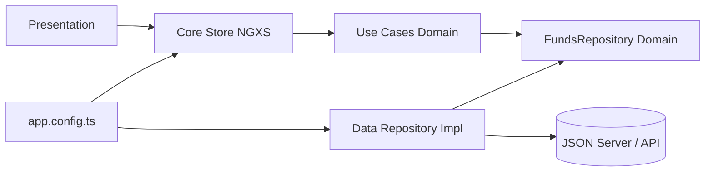

# Funds Management App

Aplicacion web para la gestion de fondos de inversion, suscripciones y cancelaciones, construida con Angular 21 y enfocada en arquitectura limpia, escalabilidad y mantenibilidad.


## Tabla de Contenido

- [Funds Management App](#funds-management-app)
  - [Tabla de Contenido](#tabla-de-contenido)
  - [Despliegue en AWS](#despliegue-en-aws)
    - [URL oficial del dominio](#url-oficial-del-dominio)
  - [https://d2msvhrypyqqi2.cloudfront.net/](#httpsd2msvhrypyqqi2cloudfrontnet)
  - [Como ejecutar localmente](#como-ejecutar-localmente)
    - [Prerrequisitos](#prerrequisitos)
    - [Paso 1 - Instalar dependencias](#paso-1---instalar-dependencias)
    - [Paso 2 - Levantar API mock con json-server](#paso-2---levantar-api-mock-con-json-server)
    - [Paso 3 - Levantar la aplicacion Angular](#paso-3---levantar-la-aplicacion-angular)
  - [Resumen del producto](#resumen-del-producto)
  - [Caracteristicas clave](#caracteristicas-clave)
  - [Arquitectura limpia](#arquitectura-limpia)
    - [Objetivo de la arquitectura](#objetivo-de-la-arquitectura)
    - [Capas del proyecto](#capas-del-proyecto)
    - [Regla de dependencia](#regla-de-dependencia)
    - [Flujo simplificado](#flujo-simplificado)
    - [Beneficios aplicados en esta app](#beneficios-aplicados-en-esta-app)
  - [Principios SOLID](#principios-solid)
  - [Atomic Design](#atomic-design)
  - [State management](#state-management)
    - [Estado central](#estado-central)
    - [Acciones principales](#acciones-principales)
    - [Ventajas](#ventajas)
  - [Clean code y buenas practicas](#clean-code-y-buenas-practicas)
  - [Stack tecnologico](#stack-tecnologico)
  - [Scripts](#scripts)
  - [Rutas principales](#rutas-principales)
  - [Estructura del proyecto](#estructura-del-proyecto)
    - [Como interpretar esta estructura](#como-interpretar-esta-estructura)
    - [Beneficio de este layout](#beneficio-de-este-layout)

## Despliegue en AWS

La aplicacion esta desplegada en AWS utilizando:

1. Amazon S3 para hosting de archivos estaticos.
2. Amazon CloudFront como CDN para distribucion global.

### URL oficial del dominio

<a href="https://d2msvhrypyqqi2.cloudfront.net/" target="_blank" rel="noopener noreferrer">
  
</a>

## <a href="https://d2msvhrypyqqi2.cloudfront.net/" target="_blank" rel="noopener noreferrer">https://d2msvhrypyqqi2.cloudfront.net/</a>

Si quieres validar rapidamente el despliegue, abre la URL y verifica navegacion por las rutas principales (`/`, `/funds`, `/subscriptions`, `/transactions`).

## Como ejecutar localmente

### Prerrequisitos

1. Node.js 20 o superior.
2. npm 11 o superior.

### Paso 1 - Instalar dependencias

```bash
npm install
```

### Paso 2 - Levantar API mock con json-server

```bash
npm run api
```

La API quedara disponible en http://localhost:3000 usando db.json.

### Paso 3 - Levantar la aplicacion Angular

En una segunda terminal:

```bash
npm start
```

La app quedara disponible en http://localhost:4200.

## Resumen del producto

La aplicacion permite:

1. Consultar el catalogo de fondos disponibles.
2. Suscribirse a fondos validando monto minimo y saldo disponible.
3. Cancelar suscripciones activas con registro de transaccion.
4. Visualizar historial de transacciones.
5. Elegir metodo de notificacion en la suscripcion (correo o SMS).

## Caracteristicas clave

| Categoria | Implementacion |
| --- | --- |
| Arquitectura | Clean Architecture por capas (domain, data, core, presentation) |
| UI | Atomic Design (atoms, molecules, organisms, pages) |
| Estado | NGXS con acciones, selectores y estado central |
| Formularios | Reactive Forms con validaciones de negocio |
| UX | Estados de carga, error y exito con feedback al usuario |
| Responsive | Adaptacion para movil y escritorio |
| Calidad | Pruebas unitarias en componentes y capas de negocio/datos |

## Arquitectura limpia

La aplicacion implementa Clean Architecture para separar responsabilidades y facilitar evolucion del codigo sin romper reglas de negocio.

### Objetivo de la arquitectura

1. Mantener el dominio independiente de frameworks y detalles externos.
2. Reducir acoplamiento entre capas.
3. Facilitar pruebas unitarias y mantenimiento.
4. Permitir extender infraestructura sin tocar logica de negocio.

### Capas del proyecto

| Capa | Responsabilidad | Ejemplos |
| --- | --- | --- |
| src/app/domain | Reglas de negocio puras | modelos, contratos de repositorio, use cases |
| src/app/data | Implementaciones concretas de acceso a datos | FundsImplementationRepository, data.providers.ts |
| src/app/core | Estado global y servicios transversales | store de NGXS, acciones, notificaciones |
| src/app/presentation | UI y composicion de pantallas | pages, organisms, molecules, atoms |
| src/app/base | Abstracciones reutilizables | contrato base de casos de uso |

### Regla de dependencia

La dependencia siempre apunta hacia dominio:

1. Presentation puede depender de core y domain.
2. Core puede depender de domain.
3. Data depende de domain para implementar contratos.
4. Domain no depende de ninguna capa externa.

### Flujo simplificado



### Beneficios aplicados en esta app

1. Cambio de fuente de datos sin romper casos de uso.
2. Logica de negocio centralizada y testeable.
3. UI desacoplada de infraestructura.
4. Mayor claridad para crecer nuevas funcionalidades.

## Principios SOLID

1. SRP: cada clase cumple una responsabilidad concreta.
2. OCP: el acceso a datos se extiende creando nuevas implementaciones.
3. LSP: cualquier implementacion de FundsRepository sustituye su contrato.
4. ISP: contratos pequenos y orientados a necesidades puntuales.
5. DIP: capas de alto nivel dependen de abstracciones.

## Atomic Design

La UI se organiza para maximizar reutilizacion:

1. Atoms: componentes base (button, badge, alert, spinner).
2. Molecules: combinaciones funcionales (subscription-form, fund-card, confirm-dialog).
3. Organisms: bloques de pagina (funds-grid, transactions-table, header, footer).
4. Pages: composicion final conectada a rutas.

Beneficios:

1. Menor duplicacion visual.
2. Escalabilidad de componentes.
3. Mantenimiento mas simple.

## State management

Se usa NGXS y se registra en app.config.ts mediante provideStore([FundsState]).

### Estado central

FundsState administra:

1. Fondos disponibles.
2. Suscripciones activas.
3. Historial de transacciones.
4. Saldo del usuario.
5. Estados de carga y error.

### Acciones principales

1. LoadFunds
2. SubscribeToFund
3. CancelSubscription
4. ResetState

### Ventajas

1. Flujo de datos predecible.
2. Selectores para consultas derivadas.
3. Trazabilidad de cambios.
4. Logica de negocio centralizada.

## Clean code y buenas practicas

1. Separacion clara entre UI y negocio.
2. Nombres expresivos en modelos, acciones y casos de uso.
3. Contratos de dominio para reducir acoplamiento.
4. Validaciones explicitas de reglas de negocio.
5. Manejo consistente de errores y notificaciones.
6. Pruebas unitarias para reducir regresiones.
7. Estructura de carpetas orientada a evolucion del producto.

## Stack tecnologico

1. Angular 21
2. TypeScript
3. Angular Material
4. NGXS
5. RxJS
6. JSON Server (API mock local)
7. Vitest + Testing Library

## Scripts

| Script | Descripcion |
| --- | --- |
| npm start | Inicia Angular en modo desarrollo |
| npm run build | Build de produccion |
| npm run watch | Build en modo watch |
| npm test | Ejecuta pruebas |
| npm run test:coverage | Ejecuta pruebas con cobertura |
| npm run api | Inicia json-server con db.json en puerto 3000 |

## Rutas principales

1. / - Inicio.
2. /funds - Catalogo de fondos.
3. /subscriptions - Suscripciones activas.
4. /transactions - Historial de transacciones.

## Estructura del proyecto

```text
src/app/
  base/
  core/
  data/
  domain/
  presentation/
    components/
      atoms/
      molecules/
      organisms/
    pages/
```

### Como interpretar esta estructura

1. `domain` concentra la logica de negocio.
2. `data` implementa el acceso a datos.
3. `core` agrupa estado global y servicios compartidos.
4. `presentation` contiene paginas y componentes UI.
5. `base` guarda abstracciones reutilizables.

### Beneficio de este layout

1. Facilita encontrar rapido donde vive cada responsabilidad.
2. Evita mezclar UI, negocio y acceso a datos en una sola carpeta.
3. Hace mas simple escalar nuevas funcionalidades sin desordenar el proyecto.
